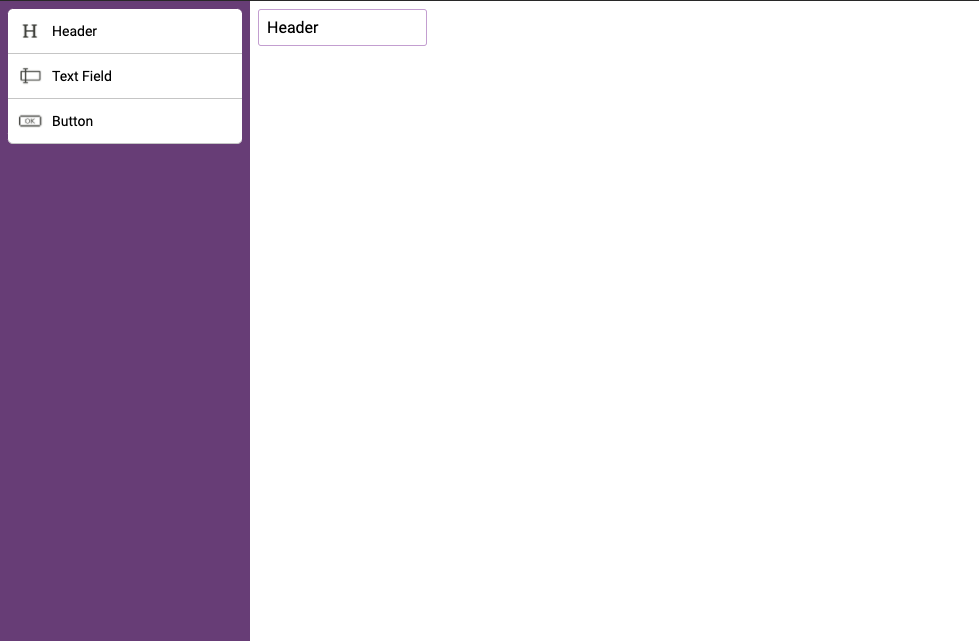

## React Form Builder

### Screenshot of final version
[Demo](https://sad-mclean-051869.netlify.app/)


### Component Breakup


### First Version - Pure Javascript ( using mouse events )
[Demo link](https://laughing-edison-270381.netlify.app/) \
[Github link](https://github.com/karthikricssion/js-drag-and-drop)


### Second Version - Pure Javascript ( using Drag events )
[Demo link](https://sharp-lewin-7964ae.netlify.app/) \
[Github link](https://github.com/karthikricssion/js-drag-and-drop)



Folder structure of the project
```
.
├── App.css
├── App.js
├── App.test.js
├── assets
│   ├── button.png
│   ├── heading.png
│   └── text-input.png
├── components
│   ├── ElementSettings.js
│   ├── FormBuilder.js
│   ├── FormElement.js
│   ├── SideBar.js
│   ├── SideBarFormElement.js
│   └── TopBar.js
├── const.js
├── index.css
├── index.js
├── logo.svg
├── normalize.css
├── serviceWorker.js
├── setupTests.js
└── utils.js

```

```
    yarn start
```
Open http://localhost:3000 to view it in the browser.
